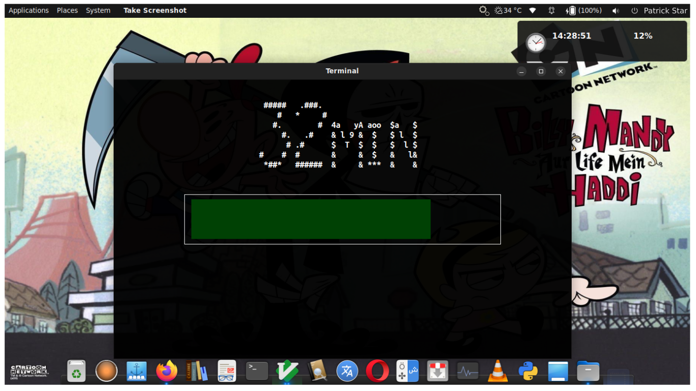
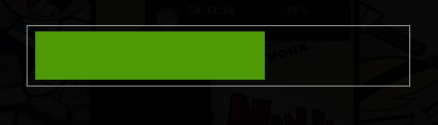
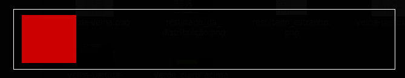
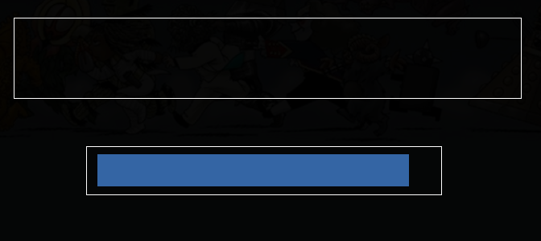

# Auto-OFF

<!-- adicionando versões compátiveis. -->
<h3> versões:&nbsp &nbsp

</h3>

Código feito em Python que desligar o sistema, informando o progresso. Usa a lib 'curses', mesmo que o 'ncurses', só que da própria biblioteca Python. O progresso é iterativo, sem falar que envia notificações do horário, caso você tenha desativado no seu computador.

<!-- imagem geral do programa, com notificação no canto -->

<figure>
    
    <figcaption> <i>Figura 1</i>: imagem geral do programa, onde aparece ele executado via terminal, a notificação no canto do programa é a notificação do horário; já como pode ser visto o sistema que o executa não tem(foi desativado)</figcaption>
      
</figure>

 As cores da barra vão mudando de acordo com que o tempo passa. Primeiro começa com um verde bem escuro, se afastando do tempo inicial, tal verde vai ficando claro, e mais claro até que atija o meio, onde ele fica amarelo; a última cor, lá para o final é vermelha, estamos falando de 15% para o fim do <i>temporizador</i>.

<figure>
    
    
    
</figure>

 Outra barra relevante é a minuto, ela aparece quando demandas de mais de <i><b>30min</b></i> são exigidas no programa. Sua aparição, como o nome já indicia, é um minuto, assim marca o minuto final. As cores dela também mudam de acordo com seu percentual, porém tem uma diferença entre ela e a barra maior -- claro, tirando que ela só marca um minuto e a outra o tempo inteiro: primeiro que ela tem uma cor a mais, a azul, que é a inicial, as outras são a mesma; seu tamanho também é menor que a prolongada; ela não aperece inicialmente quando acionada, e sim <i>pop-up</i> no minuto final. 

<figure>
    
    <figcaption><i>barra do minuto final isolada.</i></figcaption>
</figure>

